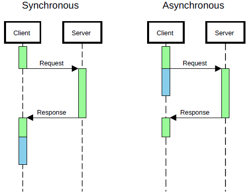

# week 4 精炼

## 1.0 TCP/IP 5-layer 网络的5层模式


---------------------------------------------------
## 2.0 URLs
### 2.0.0 URLs定义
> Uniform Resource Locator - An address that identifies a resource (web page) on the Internet


## Establishing a connection
The client first needs to establish a TCP connection to the server.
From the URL, the client has the domain name and port number
- The client first resolves the Domain using the DNS
- Once the client knows the IP address of the server it can send data to that host, requesting the service on the given port.
- The server replies, ACKnowledging the receipt of the data
- The client sends a final ACKnowledgment of its own
Once connected, the client is ready to send a HTTP request.


#### 2.0.1 Protocol (协议) 对应[http]
- Application layer protocol used in network
- HTTP (Hypertext Transfer Protocol)
- HTTPS (SSL-encrypted communication HTTP)

#### 2.0.2 Domain Name or Host name域名获宿主机名 对应[www.adelaide.edu.au]
- An identifier for Server/Host of the web application.
- If not already known to the client, must be resolved by the DNS to an IP address (Network layer)
e.g. 192.168.1.1

#### 2.0.3 Port 端口 对应[80]
- An identifier of the particular process running on the server (Transport Layer)
- 65535 ports available, with 0 to 1023 reserved.
- Default port for HTTP is 80
- Default port for HTTPS is 443

#### 2.0.4 Path 路径 对应[students]
- Path to web page in the server
- Default path usually index.html if not given

[《URL大详解》传送门](https://tools.ietf.org/html/rfc1738)


---------------------------------------------------

## 3.0 HTTP requests and Responses
### 3.1 HTTP Request
#### 3.1.1 Type of request
1. GET: get a resource (web page, image, etc)
2. POST: accept information related to a resource (usually form data)
3. HEAD: get information about the resource but not the resource itself
4. PUT: store this resource on the server
5. DELETE: delete a resource
#### 3.1.2 Path of resource
From URL
#### 3.1.3 Protocol Version of HTTP being used
- Usually HTTP/1.1 or HTTP/2.0
#### 3.1.4 Status code inidcating if the request was able to be fulfilled
- 1xx Information (100 Continue)
- 2xx Success (200 OK)
- 3xx Instructions to client (301/302 to redirect, 304 to - use cached version)
- 4xx Client Error (401 Unauthorized, 404 Not Found)
- 5xx Server Error (500 Internal Server Error)
#### 3.1.5 HTTP Headers
>Headers provide us meta information about the resource and client/server
Example request headers:
```
Accept: text/plain
If-Modified-Since: Sat, 28 Aug 2010 19:45:22 GMT
User-Agent e.g.
Host: giphy.com
Referer: https://google.com
User-Agent: Mozilla/5.0 (X11; Linux x86_64…) Gecko/20100101 Firefox/65.0
```
Example response headers:
```
Content-Type: text/html; charset=utf-8
Date: Tue, 15 Nov 1994 08:12:31 GMT
Last-Modified: Tue, 15 Dec 2010 12:45:31 GMT
```

### 3.2 HTTP Response
- The res object that express passes to our function helps us here.
  - router.get('/test', function(req,res) {
  - res represents the HTTP response that express sends.
- One of the methods of the response object res, is the send method.
  - res.send([body])
  - The body is the HTTP response body. Can be a string (html web page), or data.
code example:
```javascript
router.get('/test', function(req, res) {
res.send("This is a test"); //Let's use res.send() to send our message to the browser instead of the console.
});

```
  
---------------------------------------------------
## 4.0 Client vs Server side code 客户端和服务端 (特重点！)

- Clients access services and resources
  - Web browsers usually the clients in a web system.
- Servers provide those services and resources

### 4.1 The Client Server Model 客户端

### 4.2 HTTP server side 服务端
#### 4.2.1Building a server with Express/Node.js 用Node.js/Express搭建一个服务器
_Node.js is becoming increasingly popular for web applications_
- Javascript
  - One language client and server
  - Event driven
  - Familiar programming style
- Asynchronous 异步的
  - Performance (does not have to wait for slow operations to complete)
  - Using ‘call back’ functions (called when the operation completes, this allows the server to deal with other tasks until the call back is triggered.)

##### Express
- Express is a web applications framework for Node.js
  - Its purpose is to make it easy to write web applications in Node.js

#### 4.2.2 Routes
Routes are special functions that we can define on our server to perform actions when a given path is
requested.
```javascript
router.get('/some/path', function(req, res) {
// Do stuff
});
```

### 4.3 AJAX    超级超级超级超级重要！
#### 4.3.1 AJAX定义
>Asynchronous JavaScript And XML allows us to make HTTP requests and process the responses in the
backround.
#### 4.3.2 AJAX优点
1. Save time
    Load page content as we need it.
2. Reduce network load
    Send only the information we need.
    Allows caching of other page resources.
3. Reduce server load
    Generate HTML on client
    Less time spent processing and sending response.
4. Better user experience
    Whole page doesn't need to reload for user to view new content
    Content can be loaded in the background - seamless
#### 4.3.3 AJAX的传输过程
1. An event occurs in a web page (the page is loaded, a button is clicked)
2. An AJAX request is created by JavaScript
3. The request is sent to the web server
4. The server processes the request
5. The server sends a response back to the web page
6. The response is read by JavaScript
7. JavaScript updates the page

#### 4.3.4 同步与异步对比 Asynchronous vs Synchronous

小结：Asynchronous code allows us to prevent the main event loop from blocking while we wait for a response.
This allows the user to continue to interact with the page, which they would not be able to do if
synchronous.

#### 4.4.5 Callback functions
问：What if we want the behaviour of synchronous code (a certain action to happen action to happen after aanother), but the advantages of asynchronous code (non-blocking)?
答：Use a callback function!
> A function passed as an argument to another function to be called a
例：
```javascript
function a() {
    console.log("a");
}
function bAsync(callback) {
    console.log("b");
    callback();
}

bAsync(a); // Prints b then a
```
Do you need to use a callback?
   - Make sure that code after asynchronous calls does not rely on the asynchronous call completing.
   - If the code does rely on the asynchronous call completing, make it a callback.

#### 4.4.6 Making an AJAX Call
```javascript
/* 1. Create new AJAX request */
var xhttp = new XMLHttpRequest();

/* 4. Handle response (callback function) */
xhttp.onreadystatechange = function() {
    if (this.readyState == 4 && this.status == 200) {
        console.log(this.responseText);
    }
};

/* 2. Open connection */
xhttp.open("GET", "/request/uri", true);

/* 3. Send request */
xhttp.send();
```
#### 4.4.7 The XMLHttpRequest object
```javascript
/* 1. Create new AJAX request */
var xhttp = new XMLHttpRequest();

/* 2. Open connection */
xhttp.open("GET", "/request/uri", true);
```
> The XMLHttpRequest object is a standard javascript browser object that can be used to send requests to
servers.
- Initialise the request with the open method:
    **open(Method, URL, Asynchronous?)**
- Note that the call can be synchronous, by setting last argument to false, but then the browser will not
do any further action on the page until the server responds, and this method is deprecated.

```javascript
/* 3. Send request */
xhttp.send();
```
- Send the request to the server with the send method
    **send(Data)**
- Data is optional
- If you have data to send to the server, you send it here
  - Used for a POST request where there is form data or JSON to send to the server.

```javascript
/* 4. Handle response (callback function) */
xhttp.onreadystatechange = function() {
// do this code when the request state changes
};
```
> Sets up a listener (onreadystatechange) to listen for XMLHttpRequest events.

问： What triggers the onreadystatechange event of an XMLHttpRequest?
答： 
- When the request is opened, request.readyState == 1
- When the response headers are received, request.readyState == 2
- When the body starts to load, request.readyState == 3
- When the response is finished loading, request.readyState == 4

_The onreadystatechange function will be called every time the state changes!_
```javascript
/* 4. Handle response (callback function) */
xhttp.onreadystatechange = function() {
if (this.readyState == 4 && this.status == 200) {
        // the response is done downloading
        // and the status code was 200 OK
        // this.response will give us the response
    } else {
        // Do I want to do something when the headers arrive
      // or one of the other states,
        // or the status code is 404 or another error
    }
};
```
#### 4.4.8 Handling the AJAX response 接住 AJAX的回应
The response can be accessed using `xhttp.responseText`.

**An AJAX response can be anything!**
1. Plain text
    Usually encoded as UTF-8
2. HTML
    Ready to insert into our webpage
3. XML
    Method of storing data using DOM
4. JSON Text representation of JavaScript Object
   - JSON
    >JavaScript Object Notation is a way of representing JavaScript objects as text.
    ```json
    {
        "myarray": [
                { "name":"Max", "age":24 },
                {"name":"Ji", "age":23 }
                ],
        "count": 2
    }
    ```
    Using JSON allows us to send objects directly between the client & server!
5. Images
6. Anything!
------------------------------------
## 5.0 Cookies & Sessions
-------------------------------------
## 6.0 Express Server architecture